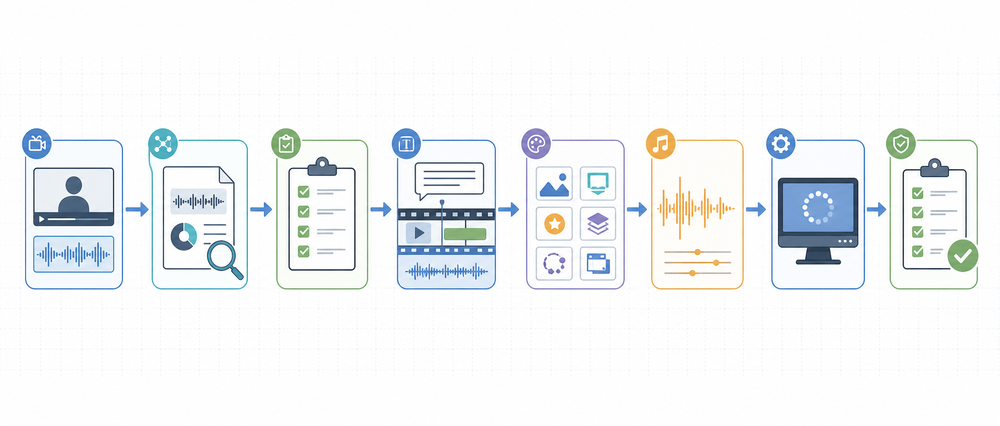

# koubo-clip

koubo-clip 是一个面向 AI agent 工作流的本地口播视频后期工具。

它把原始口播素材变成可审查、可复现、可渲染的成片：先分析内容和节奏，提出剪辑、字幕、视觉增强和配乐方案；用户确认后，再在本地完成素材落地、渲染和检查。

目标不是再造一个传统剪辑软件，也不是做黑盒一键成片。koubo-clip 希望把创作者从口播剪辑、字幕、配图、视觉组件、配乐、SFX 和成片检查这些重复劳动里解放出来，把精力放回选题、表达和内容创作。

## 它解决什么问题

口播视频创作最耗人的部分，往往不是“想讲什么”，而是后期整理：

- 从长素材里找出真正可用的表达。
- 删除停顿、等待、口头禅、误开头和重复重录。
- 给视频补上清晰字幕和必要的强调。
- 在关键解释点加入图片、图标、UI 组件、动效、B-roll 或透明标注。
- 选择合适的低音量配乐和必要的 SFX。
- 检查最终 MP4 是否真的生成，素材是否落地，画面是否遮挡，来源是否可追溯。

手工做这些事情很慢；直接让 AI “帮我剪一下” 又容易变成黑盒。koubo-clip 的做法是：agent 负责理解内容、审查候选和提出方案，CLI 负责本地确定性执行、校验、渲染和检查。

## 适合什么场景

koubo-clip 适合处理以讲解为核心的视频：

- 教程、课程、知识讲解。
- 产品演示、功能介绍、内部培训。
- 屏幕录制加旁白。
- talking-head 口播短视频。
- 需要字幕、视觉强调、图片、图标、UI 组件、配乐和 SFX 的轻量包装视频。
- 已经在使用 Codex、Claude、Hermes 或类似 agent 的本地视频工作流。

## 不适合什么场景

koubo-clip 不是完整 NLE，也不是黑盒 AI 视频生成器。它不适合：

- 多机位影视剪辑。
- 强审美驱动的广告片精修。
- 需要大量人工镜头语言设计的复杂项目。
- 不想经过 review/proposal，只想直接生成结果的工作流。
- 完全云端、账户化、多用户协作的视频编辑平台。

## 面向谁

- 短视频创作者。
- 教程、课程和知识创作者。
- 产品演示视频、内部培训视频制作者。
- 使用 AI agent 自动化处理本地素材的开发者。
- 想把视频后期流程接入 CLI 或 agent workflow 的团队。

## 工作方式



典型流程是：

```text
原始口播素材
  -> project create
  -> explore: 转写、媒体探测、素材分析
  -> review: 清理候选和风险审查
  -> proposal: 剪辑、字幕、视觉、音乐、SFX 的制作方案
  -> 用户确认
  -> visual/music/focus artifacts: 获取或导入本地素材
  -> enrich-plan: 校验最终渲染计划
  -> render: 本地渲染 MP4
  -> inspect: 抽帧和 artifact 检查
```

用户确认前，koubo-clip 只展示方案：剪哪里、为什么剪、字幕怎么做、哪里需要图片/图标/UI 组件/动效、是否需要配乐或 SFX、需要哪些 API 或联网动作。确认后才获取素材、生成音乐、写入执行 artifacts 并渲染。

render 阶段只消费已经落地到当前 project 目录的本地文件或稳定引用，不把 provider URL、临时下载地址或 API key 当成最终渲染输入。

## 当前能力

- 内容清理：检测和审查长停顿、等待、口头禅、误开头、重复重录等候选片段。
- 字幕：生成字幕文件，支持 caption rail、强调词和字幕可读性检查。
- 视觉增强：支持图标、动态图标、图片、B-roll、UI 组件、模板、透明标注和 HyperFrames elements。
- 音频：支持本地音乐、MiniMax、Freesound、Pixabay、低音量 ducking 和 SFX。
- 合成：使用 HyperFrames visual recut 和 FFmpeg 组装最终 MP4。
- 检查：通过 storyboard QA、inspection frames 和 report 检查输出。

部分视觉素材和音乐能力依赖网络、API key、用户提供的文件，或 host agent 的 MCP handoff。CLI 负责把确认后的素材导入 project，并记录来源、授权、hash 和 warnings。

## 快速开始

发布到 npm 后：

```bash
npm install -g koubo-clip
koubo-clip doctor
koubo-clip skills install --target codex
```

然后把视频交给已安装 skill 的 agent，让 agent 创建 project、分析素材、写入 proposal，并调用 CLI 校验：

```text
使用 koubo-clip 处理 ./raw.mp4。
先分析素材并给我 production proposal。
确认后再写入 edit plan、视觉/音乐 artifacts、渲染 final.mp4 并检查结果。
```

源码开发方式：

```bash
bun install
bun run koubo-clip -- doctor
bun run koubo-clip -- skills install --target codex
```

需要手动排查时，前几步可以直接运行：

```bash
koubo-clip project create ./raw.mp4
koubo-clip project explore koubo-clips/raw --asr auto
koubo-clip project review koubo-clips/raw
```

`review` 之后，CLI 不会黑盒生成制作方案。agent 或用户需要先写入 `production-proposal.json`，再运行：

```bash
koubo-clip project proposal koubo-clips/raw
```

`project proposal` 会校验 `production-proposal.json` 并生成 `production-proposal.md`。确认方案后，再继续写入 `edit-plan.json`、视觉/音乐 artifacts、`enrichment-plan.json`，并执行 render/inspect。

## 安装

源码开发方式：

```bash
git clone <repo-url>
cd koubo-clip
bun install
bun run koubo-clip -- --help
bun run koubo-clip -- doctor
```

发布到 npm 后，用户入口会是：

```bash
npm install -g koubo-clip
koubo-clip --help
koubo-clip doctor
```

安装 agent skill：

下面命令以源码开发方式为例；发布安装后，把 `bun run koubo-clip --` 换成 `koubo-clip` 即可。

```bash
# Codex: 默认 ~/.agents/skills/koubo-clip
bun run koubo-clip -- skills install --target codex

# Claude Code: 默认 ~/.claude/skills/koubo-clip
bun run koubo-clip -- skills install --target claude

# Hermes Agent: 默认 ~/.hermes/skills/koubo-clip
bun run koubo-clip -- skills install --target hermes
```

自定义 skills 目录：

```bash
bun run koubo-clip -- skills install --target codex --dest /path/to/skills
```

已经安装过并确认要覆盖：

```bash
bun run koubo-clip -- skills install --target codex --force
```

npm 包会随包发布 `skills/koubo-clip` 和 HyperFrames sidecar resources。当前包名 `koubo-clip` 已做本地发布准备；真正发布仍需要 npm 登录和版本号。

## skills.sh

仓库根目录提供 `skills.sh.json`，用于让 skills.sh 在索引公开 GitHub 仓库时把 `koubo-clip` skill 放到 Video 分组。仓库被索引后，也可以通过 skills.sh CLI 安装：

```bash
npx skills add <owner>/<repo>
```

这里的 `<owner>/<repo>` 需要替换成实际公开 GitHub 仓库名。

## 本机依赖

需要：

- Bun。
- Node.js 22+。
- FFmpeg / ffprobe。
- `npx`，用于按需调用 HyperFrames renderer。
- 可选网络访问，用于在线 ASR、音乐生成、视觉素材搜索。
- 可选 provider API key 或 MCP 配置。

macOS 推荐用 Homebrew：

```bash
brew tap oven-sh/bun
brew install bun ffmpeg node
bun --version
ffmpeg -version
npx --version
```

Windows 推荐用 winget：

```powershell
winget install --id Gyan.FFmpeg -e
winget install --id OpenJS.NodeJS.LTS -e
powershell -c "irm bun.sh/install.ps1 | iex"
bun --version
ffmpeg -version
npx --version
```

检查环境：

```bash
bun run koubo-clip -- doctor
```

`doctor` 会报告 FFmpeg、ffprobe、npx、Whisper、MiniMax、Lordicon、MCP handoff 和 bundled resources 状态。它不会输出 API key 明文。

## 配置

可以把配置放在用户目录的 `~/.koubo-clip/.env`：

```bash
mkdir -p ~/.koubo-clip
$EDITOR ~/.koubo-clip/.env
```

Windows PowerShell：

```powershell
New-Item -ItemType Directory -Force "$env:USERPROFILE\.koubo-clip"
notepad "$env:USERPROFILE\.koubo-clip\.env"
```

也可以用 shell 环境变量，或在当前 project 目录放 `.env` 做临时覆盖。加载优先级是：

```text
shell 环境变量 > 当前目录 .env > ~/.koubo-clip/.env
```

常见配置：

```bash
# 默认线上 ASR：Cloudflare Whisper
GATEWAY_CLOUDFLARE_AI_ACCOUNT_ID=...
GATEWAY_CLOUDFLARE_AI_API_TOKEN=...
GATEWAY_CLOUDFLARE_AI_TRANSCRIPTION_MODEL=@cf/openai/whisper-large-v3-turbo

# AI 生成背景音乐
MINIMAX_API_KEY=...

# 动态图标官方来源
LORDICON_API_KEY=...

# 可选：网络音乐素材
FREESOUND_API_KEY=...

# 可选：本地音乐库
MUSIC_LIBRARY_DIR=/path/to/music-library
```

说明：

- `--asr auto` 默认优先使用已有 `transcript.json`；没有 transcript 时使用线上 Cloudflare Whisper；缺少线上配置时才退到本机 `whisper-cli`。
- MiniMax 只用于 `project music-acquire`，render 阶段不联网、不读取 key。
- Iconify 静态图标不需要 key。
- Lordicon 用于动态图标候选和下载。
- Freesound 是可选网络音乐来源。
- Pixabay 目前是实验性路径，不作为稳定音乐来源。

不要把真实 key 提交到仓库。

## Agent 推荐用法

安装 skill 后，在 Codex、Claude、Hermes 或类似 agent 中描述目标，例如：

```text
使用 koubo-clip 分析这个口播视频：
剪掉停顿、等待、口头禅、误开头和重复重录。
加清晰字幕，在关键解释点加入图片、图标、UI 组件或动效。
如果适合发布效果，加入低音量背景音乐和必要 SFX。
先给我 production proposal，确认后再渲染 final.mp4，并输出检查报告。
```

agent 会读取 koubo-clip skill，调用 CLI，展示 proposal，并在用户确认后继续准备视觉/音乐素材、渲染和检查。

## 手动 CLI 流程

agent 通常会自动调用 CLI。需要手动排查时，可以按阶段运行。

前半段由 CLI 直接生成分析和 review 包：

```bash
bun run koubo-clip -- project create /path/to/video.mp4
bun run koubo-clip -- project explore koubo-clips/video --asr auto
bun run koubo-clip -- project review koubo-clips/video
```

之后的命令会读取 agent 或用户已经写入的 artifacts，而不是自动替你做创意决策：

```bash
# 需要已有 production-proposal.json
bun run koubo-clip -- project proposal koubo-clips/video

# 可选：查看可用视觉元素目录
bun run koubo-clip -- project element-catalog koubo-clips/video

# 需要已有 edit-plan.json；如使用视觉/音乐增强，还需要 enrichment-plan.json 和 asset-manifest.json
bun run koubo-clip -- project enrich-plan koubo-clips/video
bun run koubo-clip -- project render koubo-clips/video
bun run koubo-clip -- project inspect koubo-clips/video
```

视觉素材命令：

```bash
bun run koubo-clip -- project visual-catalog <project>

# 需要已有 visual-request.json
bun run koubo-clip -- project visual-search <project>
bun run koubo-clip -- project visual-acquire <project>
bun run koubo-clip -- project visual-review <project>
```

音乐命令：

```bash
bun run koubo-clip -- project music-catalog <project>

# 需要已有 music-request.json
bun run koubo-clip -- project music-acquire <project>
bun run koubo-clip -- project music-review <project>
```

涉及 UI 坐标、source highlight 或 screen-recording callout 时，先走 focus evidence：

```bash
bun run koubo-clip -- project focus-candidates <project>
bun run koubo-clip -- project focus-frames <project>
bun run koubo-clip -- project focus-grounding <project>
bun run koubo-clip -- project focus-review <project>
```

## 输出文件

常见输出在 project 目录中：

- `material-report.md`
- `review-package.md` / `review-package.json`
- `production-proposal.md` / `production-proposal.json`
- `edit-plan.json`
- `focus-*`
- `visual-*`
- `music-*`
- `asset-manifest.json`
- `enrichment-plan.json`
- `storyboard.json`
- `renders/clean.mp4`
- `renders/final.mp4`
- `.inspection/`
- `report.md`

`storyboard.json.qa_checks[]` 是合成清单也是检查清单。`project inspect` 会按它抽帧并输出 `inspection_checks[]`。

## 项目状态

- 当前版本：`0.0.1`。
- 当前包状态：准备公开 npm 发布。
- 当前推荐开发方式：源码仓库中使用 Bun。
- npm package：`koubo-clip`，发布前请先确认 npm 登录和版本号。
- 视觉素材、音乐和部分 provider 能力依赖网络、API key、用户资产或 host MCP handoff。
- 渲染依赖 FFmpeg、ffprobe、npx 和 HyperFrames 相关资源。

## 开发

```bash
bun install
bun run typecheck
bun run test
bun run pack:dry
bun run package:internal
```

开发态直接运行：

```bash
bun run koubo-clip -- --help
```

## License

koubo-clip 以 MIT License 开源，见根目录 `LICENSE`。

第三方依赖、vendored resources、生成素材和 CDN runtime 保留各自许可证，见 `THIRD_PARTY_NOTICES.md`。其中需要特别注意：`gsap` 使用 Standard "No Charge" GSAP License；HyperFrames resources 使用 Apache-2.0；Pixabay SFX 和 VS Code theme JSON 保留各自许可证。
