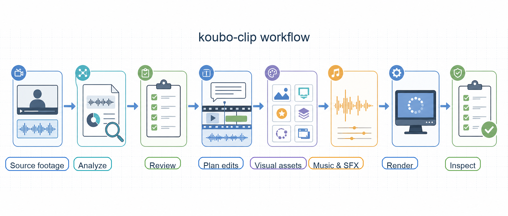

# koubo-clip

koubo-clip is a local talking-head video post-production tool built for AI agent workflows.

It turns raw spoken-video footage into reviewable, reproducible, renderable output: it analyzes the content and pacing, proposes cuts, captions, visual enrichment, and music, then renders and inspects the result locally after the user confirms the plan.

The goal is not to replace a traditional NLE, and it is not a black-box "one click video" generator. koubo-clip is meant to free creators from repetitive post-production work such as talking-head cleanup, captions, images, visual components, music, SFX, and final inspection, so they can spend more attention on ideas, structure, and expression.

## What It Solves

The slowest part of talking-head video creation is often not deciding what to say, but cleaning up the raw material:

- Finding the usable parts in long recordings.
- Removing pauses, waiting gaps, filler words, false starts, and repeated takes.
- Adding readable captions and emphasis.
- Adding images, icons, UI components, motion, B-roll, or transparent annotations at key explanation points.
- Choosing low-volume background music and useful SFX.
- Checking that the final MP4 was actually produced, assets are local, visuals do not block the subject, and provenance is traceable.

Doing this by hand is slow. Asking AI to "just edit it" is often too opaque. koubo-clip keeps the split clear: the agent understands the content, reviews candidates, and proposes the plan; the CLI performs deterministic local execution, validation, rendering, and inspection.

## Good Fits

koubo-clip is a good fit for explanation-heavy videos:

- Tutorials, courses, and knowledge videos.
- Product demos, feature walkthroughs, and internal training.
- Screen recordings with narration.
- Talking-head short videos.
- Lightweight packaged videos that need captions, visual emphasis, images, icons, UI components, music, and SFX.
- Local video workflows already using Codex, Claude, Hermes, or similar agents.

## Not A Fit

koubo-clip is not a full NLE or a black-box AI video generator. It is not designed for:

- Multi-camera film editing.
- Highly art-directed commercial finishing.
- Complex projects that require heavy manual shot design.
- Workflows that skip review/proposal and expect immediate generation.
- Fully cloud-hosted, account-based, multi-user video editing platforms.

## Who It Is For

- Short-form video creators.
- Tutorial, course, and knowledge creators.
- Product demo and internal training video makers.
- Developers using AI agents to automate local media workflows.
- Teams that want to connect video post-production to a CLI or agent workflow.

## Workflow



A typical flow:

```text
raw talking-head footage
  -> project create
  -> explore: transcription, media probing, material analysis
  -> source-frames: sample semantic evidence on the source timeline
  -> review: cleanup candidates and risk review
  -> proposal: 2-4 complete options, each with direction, edit execution, and asset needs
  -> user confirms one option exactly once
  -> confirmed edit plan + selection fingerprint
  -> visual/music/focus artifacts: acquire or import local assets
  -> enrich-plan: validate the single canonical render plan
  -> render-result: render locally and register the canonical MP4
  -> inspection: frame sampling, artifact checks, and report
```

Before the proposal, the agent may select up to 20 source times from the transcript and material report, and the CLI creates project-local JPEGs for a vision-capable host to understand the original footage. These read-only source frames do not imply user approval. Before confirmation, koubo-clip does not create the edit plan, focus/visual/music execution artifacts, or a render. A standalone workflow without vision may explicitly mark the omission and continue transcript-only; missing platform vision is a host-workflow blocker. The frame-extraction command itself never calls a vision model or provider.

`project proposal --json` returns a proposal fingerprint and selection fingerprints keyed by option id. After the user confirms, `edit-plan.json` binds that decision with `confirmed_option_id` and the matching fingerprint. Changing the selected option makes downstream artifacts explicitly stale. The confirmed option is the executable truth for the downstream plan: its structured `duration_target`, ordered `timeline`, `text_overlays`, and `asset_requirements` continue into EDL, enrichment, render, and inspect. The EDL is a CLI-derived checkpoint; when a consumer finds it stale and the authoritative inputs are complete, the same deterministic compiler rebuilds it automatically.

Render only consumes files or stable references already landed in the current project and the current canonical `enrichment-plan.json`. A simplified platform handoff may write standalone `asset-usage-plan.json`, but `project enrich-plan` must normalize it once before render. It is never a direct render input and is never implicitly merged with canonical or other legacy usage sources. Provider URLs, temporary download links, and API keys are not valid final render inputs.

## Artifact State And Recovery

Each project has a CLI-owned `artifact-manifest.json` that records artifact roles, schemas, fingerprints, direct input lineage, and stage attempts. A file's existence does not prove success. Artifact state is `missing`, `pending_validation`, `current`, `stale`, or `invalid`.

`standalone` and `platform` share the same artifact keys, lineage, and status contract. Only provider execution differs: local CLI versus host/platform. In both modes, results must first become validated project artifacts.

Hosts and agents use these public commands to discover and resume the workflow:

```bash
koubo-clip --version
koubo-clip capabilities --json
koubo-clip project status <project> --json
```

`capabilities` describes supported commands, schemas, feature flags, and provider-mode semantics; it does not probe the current machine. Environment checks remain the job of `doctor`. Read-only `project status` returns artifact/stage state, blockers, remediation, next commands, exact render inputs, the canonical deliverable, and the last successful checkpoint. Do not scan the directory, compare mtimes, or infer state from Markdown, a storyboard, or the presence of `final.mp4`.

A project without the current project contract and artifact manifest is rejected with `CONTRACT_SCHEMA_UNSUPPORTED`. The current development release supports one schema per artifact and does not infer lineage or migrate legacy directories at runtime; recreate the project with the current CLI and preserve old files separately if they are still needed for audit.

Render success is represented by current `render-result.json`, whose `canonical_output_key` explicitly selects the clean or final MP4. Inspect checks only that output and writes current `inspection.json`. `report.md` is a rebuildable human view derived from inspection; its absence does not invalidate otherwise-current machine completion.

## Current Capabilities

- Content cleanup: detects and reviews long pauses, waiting gaps, filler words, false starts, and repeated takes.
- Captions: generates subtitle files, caption rail, emphasis words, and readability checks.
- Visual enrichment: supports icons, animated icons, images, B-roll, UI components, templates, transparent annotations, and HyperFrames elements.
- Audio: supports local music, MiniMax, Freesound, Pixabay, low-volume ducking, and SFX.
- Composition: uses HyperFrames visual recut and FFmpeg to assemble the final MP4.
- Inspection: uses structured render results, inspection artifacts, storyboard QA, inspection frames, and reports to check output.

Some visual and music capabilities depend on network access, API keys, user-provided files, or host-agent MCP handoff. The CLI imports confirmed assets into the project and records source, license, hash, and warnings.

## Quick Start

npm install:

```bash
npm install -g koubo-clip
koubo-clip --version
koubo-clip capabilities --json
koubo-clip doctor
koubo-clip skills install --target codex
```

Then give the video to an agent with the installed skill and ask it to create the project, analyze the material, write the proposal, and call the CLI for validation:

```text
Use koubo-clip to process ./raw.mp4.
Analyze the material first and give me a production proposal.
I will confirm one complete option; then write the fingerprint-bound edit plan and visual/music artifacts, render the canonical MP4, and inspect it.
```

For source development:

```bash
bun install
bun run koubo-clip -- doctor
bun run koubo-clip -- skills install --target codex
```

For manual troubleshooting, the first steps can be run directly:

```bash
koubo-clip project create ./raw.mp4
koubo-clip project explore koubo-clips/raw --asr auto
koubo-clip project source-frames koubo-clips/raw
koubo-clip project review koubo-clips/raw
```

For distributed authoring without source bytes on the planning machine:

```bash
koubo-clip project create --source-manifest ./sources.json --project ./project --provider-mode platform
koubo-clip project compile-edl ./project
koubo-clip render-contract export ./project --output ./render-bundle
koubo-clip render-contract verify ./render-bundle
koubo-clip render-contract bind ./render-bundle --source-map ./source-map.json --output ./bindings.json
koubo-clip render-contract render ./render-bundle --bindings ./bindings.json --output ./strict-run
koubo-clip render-contract inspect ./render-bundle --result ./strict-run/render-contract-result.json
```

The contract is CLI-owned and immutable. A strict consumer never reads transcript, analysis, edit-plan, or enrichment-plan files and never replans missing authoring state.

After `review`, the CLI does not generate a production plan as a black box. The agent or user must write `production-proposal.json` first, then run:

```bash
koubo-clip project proposal koubo-clips/raw --json
```

`project proposal --json` validates `production-proposal.json`, writes `production-proposal.md`, and returns a selection fingerprint for every option. Each option already combines its business direction, edit execution plan, and asset requirements, so the user confirms exactly once. After confirmation, write the option id and fingerprint into `edit-plan.json`, prepare visual/music artifacts and canonical `enrichment-plan.json`, then run render/inspect. The confirmed option's `duration_target`, ordered `timeline`, and `text_overlays` are part of the execution contract, not just the proposal display.

## Install

For source development:

```bash
git clone <repo-url>
cd koubo-clip
bun install
bun run koubo-clip -- --help
bun run koubo-clip -- doctor
```

After npm publication, the user entrypoint will be:

```bash
npm install -g koubo-clip
koubo-clip --help
koubo-clip doctor
```

Install the agent skill:

The examples below use source development commands. After global npm installation, replace `bun run koubo-clip --` with `koubo-clip`.

```bash
# Codex: defaults to ~/.agents/skills/koubo-clip
bun run koubo-clip -- skills install --target codex

# Claude Code: defaults to ~/.claude/skills/koubo-clip
bun run koubo-clip -- skills install --target claude

# Hermes Agent: defaults to ~/.hermes/skills/koubo-clip
bun run koubo-clip -- skills install --target hermes
```

Use a custom skills directory:

```bash
bun run koubo-clip -- skills install --target codex --dest /path/to/skills
```

Overwrite an existing install:

```bash
bun run koubo-clip -- skills install --target codex --force
```

The npm package includes `skills/koubo-clip` and HyperFrames sidecar resources. The public package name is `koubo-clip`.

## skills.sh

The repository root includes `skills.sh.json` so skills.sh can place the public `koubo-clip` skill in the Video group after the GitHub repository is indexed. After indexing, it can also be installed with the skills.sh CLI:

```bash
npx skills add <owner>/<repo>
```

Replace `<owner>/<repo>` with the actual public GitHub repository name.

## Local Dependencies

Required:

- Bun.
- Node.js 22+.
- FFmpeg / ffprobe.
- `npx`, used to invoke the HyperFrames renderer when needed.
- Optional network access for online ASR, music generation, and visual asset search.
- Optional provider API keys or MCP configuration.

Recommended macOS install with Homebrew:

```bash
brew tap oven-sh/bun
brew install bun ffmpeg node
bun --version
ffmpeg -version
npx --version
```

Recommended Windows install with winget and PowerShell:

```powershell
winget install --id Gyan.FFmpeg -e
winget install --id OpenJS.NodeJS.LTS -e
powershell -c "irm bun.sh/install.ps1 | iex"
bun --version
ffmpeg -version
npx --version
```

Check the environment:

```bash
bun run koubo-clip -- doctor
```

`doctor` reports FFmpeg, ffprobe, npx, Whisper, MiniMax, Lordicon, MCP handoff, and bundled resources. It does not print API keys.

## Configuration

Configuration can live in `~/.koubo-clip/.env`:

```bash
mkdir -p ~/.koubo-clip
$EDITOR ~/.koubo-clip/.env
```

Windows PowerShell:

```powershell
New-Item -ItemType Directory -Force "$env:USERPROFILE\.koubo-clip"
notepad "$env:USERPROFILE\.koubo-clip\.env"
```

Shell environment variables can also be used. A temporary `.env` in the current project directory works too. Load order:

```text
shell environment variables > current directory .env > ~/.koubo-clip/.env
```

Common configuration:

```bash
# Default online ASR: Cloudflare Whisper
GATEWAY_CLOUDFLARE_AI_ACCOUNT_ID=...
GATEWAY_CLOUDFLARE_AI_API_TOKEN=...
GATEWAY_CLOUDFLARE_AI_TRANSCRIPTION_MODEL=@cf/openai/whisper-large-v3-turbo

# AI-generated background music
MINIMAX_API_KEY=...

# Official animated icon source
LORDICON_API_KEY=...

# Optional network music source
FREESOUND_API_KEY=...

# Optional local music library
MUSIC_LIBRARY_DIR=/path/to/music-library
```

Notes:

- `--asr auto` first uses an existing `transcript.json`; without one, it uses online Cloudflare Whisper; without online configuration, it falls back to local `whisper-cli`.
- MiniMax is only used by `project music-acquire`; render does not go online or read keys.
- Iconify static icons do not require a key.
- Lordicon is used for animated icon candidates and downloads.
- Freesound is an optional network music source.
- Pixabay is currently experimental and not a stable music source.

Do not commit real keys to the repository.

## Recommended Agent Usage

After installing the skill, describe the target in Codex, Claude, Hermes, or a similar agent:

```text
Use koubo-clip to analyze this talking-head video:
remove pauses, waiting gaps, filler words, false starts, and repeated takes.
Add readable captions and add images, icons, UI components, or motion at key explanation points.
If it helps the publish quality, add low-volume background music and necessary SFX.
Give me a production proposal with complete options first; after one confirmation, render the canonical MP4 and output structured inspection plus the human report.
```

The agent reads the koubo-clip skill, calls the CLI, presents the proposal, then prepares visual/music assets, renders, and inspects after user confirmation.

## Manual CLI Flow

Agents usually call the CLI automatically. For manual troubleshooting, run the flow by stages.

Discover the software contract first. When resuming an existing project, use read-only status:

```bash
bun run koubo-clip -- --version
bun run koubo-clip -- capabilities --json
bun run koubo-clip -- project status koubo-clips/video --json
```

The first half is generated directly by the CLI:

```bash
bun run koubo-clip -- project create /path/to/video.mp4
bun run koubo-clip -- project explore koubo-clips/video --asr auto
bun run koubo-clip -- project source-frames koubo-clips/video
bun run koubo-clip -- project review koubo-clips/video
```

`project source-frames` reads an agent-authored `source-frame-request.json` and creates read-only source evidence at source-local times. The CLI does not choose the timestamps or make visual judgments.

The following commands read artifacts already written by the agent or user. They do not make creative decisions automatically:

```bash
# Requires production-proposal.json
bun run koubo-clip -- project proposal koubo-clips/video --json

# Optional: inspect available visual elements
bun run koubo-clip -- project element-catalog koubo-clips/video

# Requires edit-plan.json; when visual/music enrichment is used, also requires enrichment-plan.json and asset-manifest.json
bun run koubo-clip -- project enrich-plan koubo-clips/video
bun run koubo-clip -- project render koubo-clips/video
bun run koubo-clip -- project inspect koubo-clips/video
```

Visual asset commands:

```bash
bun run koubo-clip -- project visual-catalog <project>

# Requires visual-request.json
bun run koubo-clip -- project visual-search <project>
bun run koubo-clip -- project visual-acquire <project>
bun run koubo-clip -- project visual-review <project>
```

Music commands:

```bash
bun run koubo-clip -- project music-catalog <project>

# Requires music-request.json
bun run koubo-clip -- project music-acquire <project>
bun run koubo-clip -- project music-review <project>
```

For UI coordinates, source highlight, or screen-recording callouts, collect focus evidence first:

```bash
bun run koubo-clip -- project focus-candidates <project>
bun run koubo-clip -- project focus-frames <project>
bun run koubo-clip -- project focus-grounding <project>
bun run koubo-clip -- project focus-review <project>
```

## Output Files

Common files in the project directory:

- `material-report.md`
- `source-frame-request.json` / `source-frames.json`
- `.source-frames/`
- `review-package.md` / `review-package.json`
- `production-proposal.md` / `production-proposal.json`
- `artifact-manifest.json`
- `edit-plan.json`
- `asset-usage-plan.json` (simplified/compatibility input only)
- `focus-*`
- `visual-*`
- `music-*`
- `asset-manifest.json`
- `enrichment-plan.json`
- `storyboard.json`
- `renders/clean.mp4`
- `renders/final.mp4`
- `render-result.json`
- `inspection.json`
- `.inspection/`
- `report.md`

`storyboard.json.qa_checks[]` is both the composition checklist and inspection checklist, but the storyboard is consumable only while its lineage is current. `project inspect` samples the canonical output from the current render result and outputs `inspection_checks[]`.

## Project Status

- Use `koubo-clip --version` as the installed version source; the README does not hard-code it.
- Current package status: published to npm with detached authoring and strict render-contract execution in the stable line.
- Current recommended development mode: use Bun from the source repository.
- npm package: `koubo-clip`.
- Visual assets, music, and some provider capabilities depend on network access, API keys, user assets, or host MCP handoff.
- Rendering depends on FFmpeg, ffprobe, npx, and HyperFrames resources.
- The public artifact/state discovery surface is `capabilities --json` plus `project status --json`.

## Development

```bash
bun install
bun run typecheck
bun run test
bun run pack:dry
bun run package:internal
```

Run directly in development:

```bash
bun run koubo-clip -- --help
```

### AI-Assisted Development

koubo-clip is also developed with AI tools such as Codex and Claude Code. Before contributing, make your AI tool read the project instructions:

- Codex: use the root `AGENTS.md` as the project instruction entrypoint; it links to the long-lived constraints in `docs/` and `rules/`.
- Claude Code: create or update a root `CLAUDE.md` from the project section of `AGENTS.md` plus the relevant `docs/` and `rules/`, then start the Claude Code session.

Do not commit local tokens, npm keys, API keys, or personal machine paths to `AGENTS.md`, `CLAUDE.md`, or any other file.

## License

koubo-clip is released under the MIT License. See [LICENSE](LICENSE).

Third-party dependencies, vendored resources, generated assets, and CDN runtimes keep their own licenses. See [THIRD_PARTY_NOTICES.md](THIRD_PARTY_NOTICES.md). In particular: `gsap` uses the Standard "No Charge" GSAP License; HyperFrames resources use Apache-2.0; Pixabay SFX and VS Code theme JSON files keep their own licenses.
